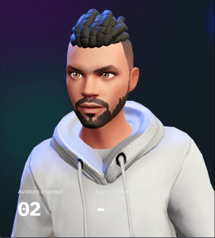

Eaew, dev :rocket: :rocket: :rocket: 
## Esse sou o ***Murilo Gois(🇧🇷)***...
---

  
  

  
 

	

    	
  	

    
    
    
    
    
    

Eu sou um jovem desenvolvedor FullStack sempre em busca de novos desafios e experiencias com novas tecnologias.  
Fique a vontade pra entrar em contato comigo atraves de minhas redes sociais. 
Vlw :smile: :v:

 

  
 	
  
      
    
    
 

<!-- 
	#7848a8	rgb (120, 72, 168)	Royal Lavender
	#481860	rgb (72, 24, 96)	Obsidian Shell
	#603090	rgb (96, 48, 144)	True Purple
	#481890	rgb (72, 24, 144)	Eggplant Tint -->